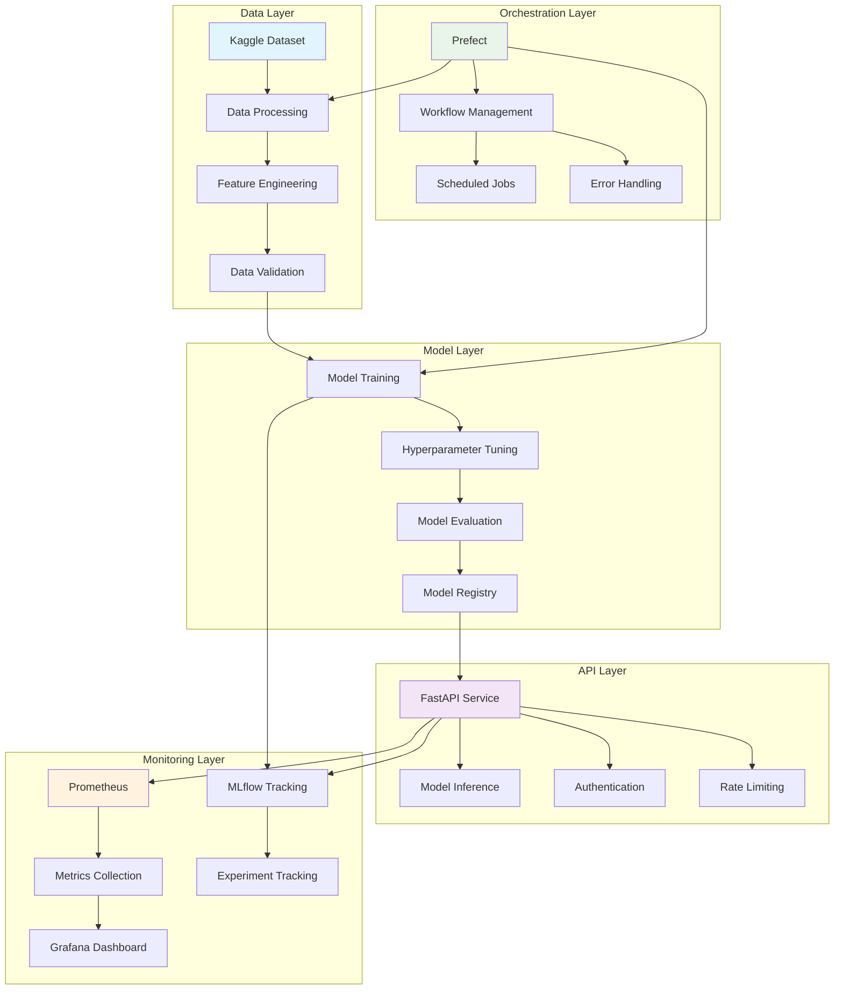

# 🤖 News Classification MLOps

[](https://www.python.org/downloads/)
[](https://opensource.org/licenses/MIT)
[](https://mlops.org)
[](https://www.docker.com/)
[](https://kubernetes.io/)

# 🚀 MLOps Demo Platform

A production-oriented, end-to-end MLOps reference implementation demonstrating how machine learning systems can be built, deployed, monitored, and operated
reliably using modern tooling.

## 📋 Table of Contents

- [🎯 Overview](#-overview)
- [✨ Features](#-features)
- [🏗️ Architecture](#️-architecture)
- [📋 Prerequisites](#-prerequisites)
- [🚀 Quick Start](#-quick-start)
  - [Docker Compose (Recommended)](#docker-compose-recommended)
  - [☸️ Kubernetes (Experimental)](#️-kubernetes-experimental)
- [📁 Project Structure](#-project-structure)
- [🔧 Configuration](#-configuration)
- [🔍 Monitoring & Observability](#-monitoring--observability)
- [🧪 Testing](#-testing)
- [☁️ Cloud Deployment](#-cloud-deployment)
- [🛠️ Development](#️-development)
- [🔧 Troubleshooting](#-troubleshooting)
- [🤝 Contributing](#-contributing)
- [📄 License](#-license)

## 🎯 Overview

This project implements a complete MLOps pipeline for news classification using BBC articles from Kaggle. It showcases industry-standard practices for:

- **Data Pipeline**: Automated data ingestion, preprocessing, and validation
- **Model Training**: Experiment tracking, hyperparameter tuning, and model versioning
- **Model Serving**: RESTful API with authentication and monitoring
- **Orchestration**: Workflow management with dependency resolution
- **Monitoring**: Real-time metrics, performance tracking, and alerting
- **Testing**: Unit tests, integration tests, and load testing
- **Deployment**: Container-based deployment with Docker and Kubernetes support

## ✨ Features

### 🔄 **Complete MLOps Pipeline**
- Automated data processing and feature engineering
- Model training with hyperparameter optimization
- Experiment tracking and model registry
- CI/CD pipeline with automated testing

### 🚀 **Production-Ready API**
- FastAPI-based REST service with async support
- API key authentication and rate limiting
- Model versioning and A/B testing support
- Comprehensive API documentation with Swagger/OpenAPI

### 📊 **Monitoring & Observability**
- Real-time metrics collection with Prometheus
- Interactive dashboards with Grafana
- Model performance monitoring and drift detection
- System health and resource utilization tracking

### 🎯 **Workflow Orchestration**
- Prefect-based workflow management
- Dependency resolution and error handling
- Scheduled and event-driven execution
- Flow visualization and debugging

### 🧪 **Comprehensive Testing**
- Unit tests for all core components
- Integration tests for API endpoints
- Load testing with Locust
- Model validation and performance testing

### 🐳 **Container-Based Deployment**
- Multi-stage Docker builds for optimization
- Docker Compose for local development
- Kubernetes manifests for production deployment
- Environment-specific configurations

### 🔐 **Security Best Practices**
- Secure secret management
- API authentication and authorization
- Network policies and access control
- Container security scanning

## 🏗️ Architecture



## 📋 Prerequisites

### Required Software
- **Docker**: 20.10+ and **Docker Compose**: 2.0+
- **Python**: 3.10+ (for local development)
- **Git**: For version control

### Optional (for Kubernetes deployment)
- **Kubernetes**: 1.20+ cluster
- **kubectl**: Configured to access your cluster
- **Ingress Controller**: For external access (nginx/traefik)

### Required Accounts
- **Kaggle**: For dataset access
- **GitHub**: For CI/CD (if using GitHub Actions)
- **Container Registry**: Docker Hub, GHCR, or similar

## 🚀 Quick Start

### Docker Compose (Recommended) 🐳

The fastest way to get started is using Docker Compose, which spins up all services with pre-configured monitoring and orchestration.

#### 1. Clone the Repository
```bash
git clone https://github.com/nasirtrekker/mlops-demo.git
cd mlops-demo
```

#### 2. Environment Setup
```bash
# Copy the environment template
cp .env.example .env

# Edit the environment file with your settings
nano .env
```

Required environment variables:
```env
# API Configuration
API_KEY=your_secure_api_key_here
CACHE_TTL=3600

# Kaggle Configuration
KAGGLE_USERNAME=your_kaggle_username
KAGGLE_API_KEY=your_kaggle_api_key

# Model Configuration
MODEL_NAME=news_classifier_logistic
MODEL_VERSION=1

# Optional: Custom Ports
PROMETHEUS_PORT=9090
GRAFANA_PORT=3000
MLFLOW_PORT=5000
PREFECT_PORT=4200
API_PORT=7860
LOCUST_PORT=8089
```

> ⚠️ **Security Note**: Never commit your `.env` file to version control. Add it to `.gitignore`.

#### 3. Launch Services
```bash
# Start all services in detached mode
docker-compose up -d

# Verify all services are running
docker-compose ps

# View logs for all services
docker-compose logs -f
```

#### 4. Access Services
Once running, access the services at:

- **🚀 FastAPI App**: [http://localhost:7860](http://localhost:7860) - API Documentation available
- **📊 MLflow**: [http://localhost:5000](http://localhost:5000) - Model tracking and registry
- **📈 Grafana**: [http://localhost:3000](http://localhost:3000) - Monitoring dashboards (admin/admin)
- **🔍 Prometheus**: [http://localhost:9090](http://localhost:9090) - Metrics collection
- **⚙️ Prefect**: [http://localhost:4200](http://localhost:4200) - Workflow orchestration
- **🦗 Locust**: [http://localhost:8089](http://localhost:8089) - Load testing interface

#### 5. Run the Pipeline
```bash
# Trigger the MLOps pipeline via API
curl -X POST "http://localhost:7860/run-pipeline" \
  -H "X-API-Key: your_api_key" \
  -H "Content-Type: application/json"

# Or trigger via Prefect UI
# Navigate to http://localhost:4200 and run the "mlops_pipeline" flow
```

#### 6. Stop Services
```bash
# Stop and remove all containers
docker-compose down

# Stop and remove volumes (data will be lost)
docker-compose down -v
```

### ☸️ Kubernetes (Experimental) ⚠️

> **Note**: Kubernetes deployment is currently experimental and intended for advanced users. Production deployment requires additional configuration for persistence, security, and networking.

#### Prerequisites for K8s
- Working Kubernetes cluster (local: minikube, kind; cloud: EKS, GKE, AKS)
- `kubectl` configured and cluster access
- Container registry access for image pushing

#### Quick K8s Deployment

1. **Create Namespace and Secrets**
```bash
# Create the namespace
kubectl apply -f k8s/00-namespace.yml

# Create secrets from environment file
cat << EOF > .kube-secrets
API_KEY=your_api_key
KAGGLE_USERNAME=your_kaggle_username
KAGGLE_API_KEY=your_kaggle_api_key
GF_SECURITY_ADMIN_PASSWORD=your_grafana_password
EOF

kubectl create secret generic mlops-secrets --from-env-file=.kube-secrets -n mlops
```

2. **Deploy Infrastructure**
```bash
# Deploy core services
kubectl apply -f k8s/02-configmap.yml
kubectl apply -f k8s/03-prometheus-deployment.yml
kubectl apply -f k8s/04-grafana-deployment.yml
kubectl apply -f k8s/05-mlflow-deployment.yml
kubectl apply -f k8s/06-prefect-deployment.yml

# Deploy application
kubectl apply -f k8s/07-api-deployment.yml

# Optional: Load testing
kubectl apply -f k8s/08-locust-deployment.yml
```

3. **Access Services**
```bash
# Use port forwarding for local access
kubectl port-forward svc/api 7860:7860 -n mlops &
kubectl port-forward svc/mlflow 5000:5000 -n mlops &
kubectl port-forward svc/grafana 3000:3000 -n mlops &
kubectl port-forward svc/prometheus 9090:9090 -n mlops &
kubectl port-forward svc/prefect 4200:4200 -n mlops &
```

For detailed Kubernetes instructions, see [k8s/DEPLOYMENT-GUIDE.md](k8s/DEPLOYMENT-GUIDE.md).

## 📁 Project Structure

```
A-to-Z-MLOps/
├── 📂 src/                          # Source code
│   ├── 📂 data/                     # Data processing modules
│   │   ├── download.py              # Kaggle data download
│   │   ├── preprocessing.py         # Data cleaning and preprocessing
│   │   └── validation.py            # Data quality checks
│   ├── 📂 models/                   # Model training and evaluation
│   │   ├── train.py                 # Model training with MLflow tracking
│   │   ├── evaluate.py              # Model evaluation metrics
│   │   └── predict.py               # Model inference utilities
│   ├── 📂 api/                      # FastAPI application
│   │   ├── main.py                  # FastAPI app and endpoints
│   │   ├── auth.py                  # Authentication middleware
│   │   ├── middleware.py            # Custom middleware
│   │   └── monitoring.py            # Prometheus metrics
│   └── 📂 pipelines/                # Prefect workflows
│       ├── pipeline.py              # Main MLOps pipeline
│       ├── flows.py                 # Individual workflow components
│       └── tasks.py                 # Workflow task definitions
├── 📂 tests/                        # Test suite
│   ├── 📂 unit/                     # Unit tests
│   ├── 📂 integration/              # Integration tests
│   ├── 📂 stress/                   # Load testing scripts
│   └── conftest.py                  # Pytest configuration
├── 📂 configs/                      # Configuration files
│   ├── mlflow_config.yaml           # MLflow settings
│   ├── model_params.yaml            # Model hyperparameters
│   ├── grafana/                     # Grafana dashboards and datasources
│   └── prometheus.yml               # Prometheus configuration
├── 📂 k8s/                          # Kubernetes manifests (Experimental)
│   ├── 00-namespace.yml             # Namespace definition
│   ├── 02-configmap.yml             # Configuration maps
│   ├── 03-prometheus-deployment.yml # Prometheus deployment
│   ├── 04-grafana-deployment.yml    # Grafana deployment
│   ├── 05-mlflow-deployment.yml     # MLflow deployment
│   ├── 06-prefect-deployment.yml    # Prefect deployment
│   ├── 07-api-deployment.yml        # API deployment
│   ├── 08-locust-deployment.yml     # Locust deployment
│   └── DEPLOYMENT-GUIDE.md          # Detailed K8s guide
├── 📂 workflows/                    # CI/CD workflows
│   └── ci-cd.yml                    # GitHub Actions workflow
├── 📂 notebooks/                    # Jupyter notebooks
│   ├── 01-exploratory-data-analysis.ipynb
│   ├── 02-model-experimentation.ipynb
│   └── 03-performance-evaluation.ipynb
├── 📂 data/                         # Data directory
│   ├── raw/                         # Raw downloaded data
│   ├── processed/                   # Processed training data
│   └── validation/                  # Validation datasets
├── 📂 models/                       # Trained models storage
├── 📂 images/                       # Documentation images
├── 📄 Dockerfile                    # Multi-stage Docker build
├── 📄 docker-compose.yml            # Local development setup
├── 📄 pyproject.toml                # Python project configuration
├── 📄 .env.example                  # Environment variables template
└── 📄 README.md                     # This file
```

## 🔧 Configuration

### Environment Variables

The application uses environment variables for configuration. Key variables include:

| Variable | Description | Default | Required |
|----------|-------------|---------|----------|
| `API_KEY` | API authentication key | None | ✅ |
| `KAGGLE_USERNAME` | Kaggle username for data download | None | ✅ |
| `KAGGLE_API_KEY` | Kaggle API key | None | ✅ |
| `MODEL_NAME` | MLflow model name | `news_classifier_logistic` | ❌ |
| `MODEL_VERSION` | Model version to deploy | `1` | ❌ |
| `CACHE_TTL` | Cache time-to-live (seconds) | `3600` | ❌ |
| `MLFLOW_TRACKING_URI` | MLflow server URI | `http://mlflow:5000` | ❌ |
| `PREFECT_API_URL` | Prefect server URL | `http://prefect:4200/api` | ❌ |

### Model Configuration

Model hyperparameters are configured in [`configs/model_params.yaml`](configs/model_params.yaml):

```yaml
logistic:
  classifier__C: [0.1, 1.0, 10.0]
  classifier__penalty: ['l2']
  tfidf__ngram_range: [[1, 1], [1, 2]]
  tfidf__max_features: [5000, 10000]

svm:
  classifier__C: [0.1, 1.0, 10.0]
  classifier__penalty: ['l2']
  tfidf__ngram_range: [[1, 1], [1, 2]]

rf:
  classifier__n_estimators: [50, 100, 200]
  classifier__max_depth: [10, 20, None]
  tfidf__max_features: [5000, 10000]
```

## 🔍 Monitoring & Observability

### 📊 Grafana Dashboards

The project includes pre-configured Grafana dashboards for:

- **System Overview**: CPU, memory, and disk usage
- **API Performance**: Request rates, response times, error rates
- **Model Metrics**: Accuracy, precision, recall, F1 scores
- **MLflow Tracking**: Experiment metrics and model performance

### 📈 Prometheus Metrics

Key metrics collected:

```python
# API Metrics
api_request_total{endpoint, method, status}
api_request_duration_seconds{endpoint, method}
api_active_connections

# Model Metrics
model_prediction_total{model_name, version}
model_prediction_accuracy{model_name, version}
model_inference_duration_seconds{model_name}

# System Metrics
container_cpu_usage_seconds_total
container_memory_usage_bytes
container_network_receive_bytes_total
```

### 🧪 MLflow Experiment Tracking

MLflow tracks:

- **Parameters**: Hyperparameters and model settings
- **Metrics**: Accuracy, precision, recall, F1, log loss, ROC AUC
- **Artifacts**: Trained models, confusion matrices, ROC curves
- **Model Registry**: Model versions, stages, and metadata

## 🧪 Testing

### Run All Tests
```bash
# Run unit and integration tests
pytest tests/ -v

# Run tests with coverage
pytest tests/ --cov=src --cov-report=html

# Run load tests
locust -f tests/stress_test.py --host=http://localhost:7860
```

### Test Categories

1. **Unit Tests** (`tests/unit/`):
   - Model training and evaluation
   - Data processing functions
   - API endpoint logic

2. **Integration Tests** (`tests/integration/`):
   - API endpoint testing
   - Database operations
   - External service integration

3. **Load Tests** (`tests/stress_test.py`):
   - API performance under load
   - Concurrent request handling
   - Resource utilization monitoring

## ☁️ Cloud Deployment

### AWS EKS Deployment

```bash
# Create EKS cluster
eksctl create cluster --name mlops-cluster --region us-west-2

# Store container registry credentials
aws ecr get-login-password --region us-west-2 | docker login --username AWS --password-stdin <account-id>.dkr.ecr.us-west-2.amazonaws.com

# Deploy with AWS-specific configurations
kubectl apply -f k8s/aws-storage-class.yml
kubectl apply -f k8s/
```

### Google GKE Deployment

```bash
# Create GKE cluster
gcloud container clusters create mlops-cluster --num-nodes=3

# Configure container registry access
gcloud auth configure-docker

# Deploy services
kubectl apply -f k8s/
```

### Azure AKS Deployment

```bash
# Create AKS cluster
az aks create --resource-group mlops-rg --name mlops-cluster --node-count 3

# Get cluster credentials
az aks get-credentials --resource-group mlops-rg --name mlops-cluster

# Deploy services
kubectl apply -f k8s/
```

## 🛠️ Development

### Local Development Setup

1. **Install Dependencies**
```bash
# Install uv for fast package management
pip install uv

# Install project dependencies
uv pip install -r requirements.txt

# Install development dependencies
uv pip install -r requirements-dev.txt
```

2. **Pre-commit Hooks**
```bash
# Install pre-commit hooks
pre-commit install

# Run hooks manually
pre-commit run --all-files
```

3. **Code Quality**
```bash
# Format code
black src/ tests/

# Lint code
flake8 src/ tests/

# Type checking
mypy src/
```

### Adding New Models

1. **Update Model Configuration** (`configs/model_params.yaml`)
2. **Modify Training Script** (`src/models/train.py`)
3. **Add Tests** (`tests/unit/test_models.py`)
4. **Update API Documentation** (`src/api/main.py`)

### Extending API Endpoints

1. **Add New Endpoint** (`src/api/main.py`)
2. **Add Authentication** (if required)
3. **Add Monitoring Metrics**
4. **Write Integration Tests** (`tests/integration/`)

## 🔧 Troubleshooting

### 🚨 Common Issues

#### Docker Issues
```bash
# Check Docker daemon
docker info

# Check container logs
docker-compose logs <service-name>

# Restart services
docker-compose restart

# Clean up unused resources
docker system prune -a
```

#### API Issues
```bash
# Test API connectivity
curl -X GET "http://localhost:7860/info" \
  -H "X-API-Key: your_api_key"

# Check API logs
docker-compose logs api

# Test model prediction
curl -X POST "http://localhost:7860/predict" \
  -H "X-API-Key: your_api_key" \
  -H "Content-Type: application/json" \
  -d '{"text": "Test news article"}'
```

#### MLflow Issues
```bash
# Check MLflow server status
curl http://localhost:5000/health

# Verify experiment exists
curl -X GET "http://localhost:5000/api/2.0/mlflow/experiments/get-by-name?experiment_name=news-classifier"

# Check MLflow logs
docker-compose logs mlflow
```

#### Kubernetes Issues
```bash
# Check pod status
kubectl get pods -n mlops

# Describe pod issues
kubectl describe pod <pod-name> -n mlops

# View pod logs
kubectl logs <pod-name> -n mlops -f

# Check service connectivity
kubectl run -it --rm debug --image=busybox --restart=Never -- \
  sh -c "nslookup mlflow.mlops"
```

### 🐛 Debug Mode

Enable debug logging by setting the environment variable:
```env
LOG_LEVEL=DEBUG
```

Or temporarily enable for Docker Compose:
```bash
docker-compose run --rm -e LOG_LEVEL=DEBUG api python -m src.api.main
```

## 🤝 Contributing

We welcome contributions! Please see our [Contributing Guide](CONTRIBUTING.md) for details.

### Development Workflow
1. Fork the repository
2. Create a feature branch (`git checkout -b feature/amazing-feature`)
3. Make your changes
4. Add tests for new functionality
5. Run the test suite (`pytest`)
6. Commit your changes (`git commit -m 'Add amazing feature'`)
7. Push to the branch (`git push origin feature/amazing-feature`)
8. Open a Pull Request

## 📄 License

This project is licensed under the MIT License - see the [LICENSE](LICENSE) file for details.

## 🙏 Acknowledgments

- **BBC News Dataset**: Provided via Kaggle for research purposes
- **Open Source Community**: Thanks to all contributors of the libraries used
- **MLOps Community**: For best practices and patterns inspiration

